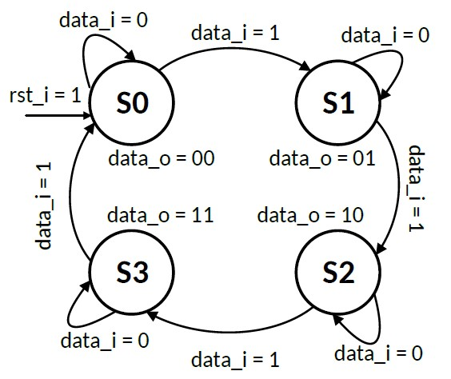

# Moore FSM

Finite State Machine of type Moore with 4 states.

__Author__

[Levindo Gabriel Taschetto Neto (IPVS)](http://levindoneto.com)

## Finite State Machine

This FSM is a 2-bit-counter that counts the number of bit 1 in data_i signal. The image bellow shows the state diagram of this FSM. It is a Moore state machine since the change of output data_o only depends on the current state not on the current input data_i.

## Repository Structure

* [Scripts](scripts) (Used scripts to use the project on the Vivado tool).

* [VHDL Files](vhdl_files) (contains the vhdl files of the run-length encoder, as the hardware description and simulation).

## License

MIT License. Click [here](LICENSE.md) for more information about this license.

