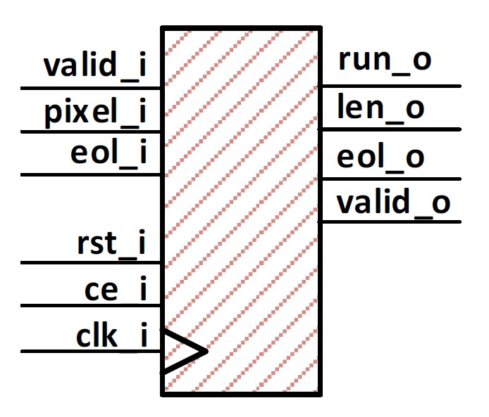
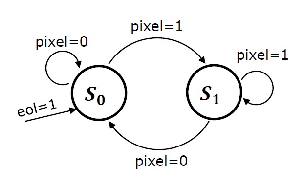

# Facsimile Coding with System Generator

Module “run_length_encoder” using VHDL language.

__Author__

[Levindo Gabriel Taschetto Neto (IPVS)](http://levindoneto.com)

## Module 

The module in a high level view can be seen in the image bellow.

## Finite State Machine

The FSM can be seen bellow.

## Repository Structure

* [Scripts](scripts) (Used scripts to use the project on the Vivado tool).

* [VHDL Files](vhdl_files) (contains the vhdl files of the run-length encoder, as the hardware description and simulation).

## License

MIT License. Click [here](LICENSE.md) for more information about this license.

