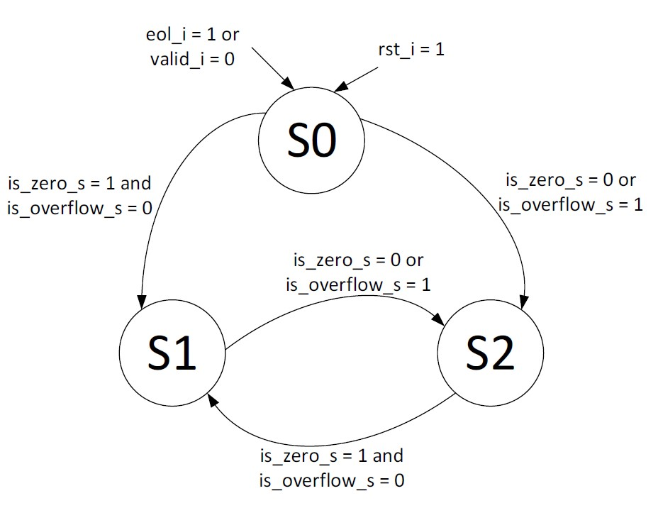
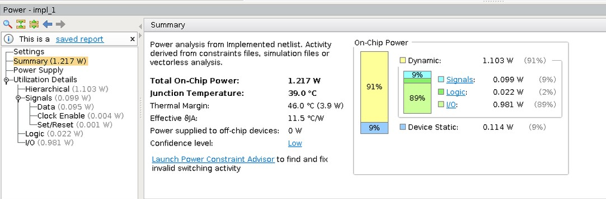
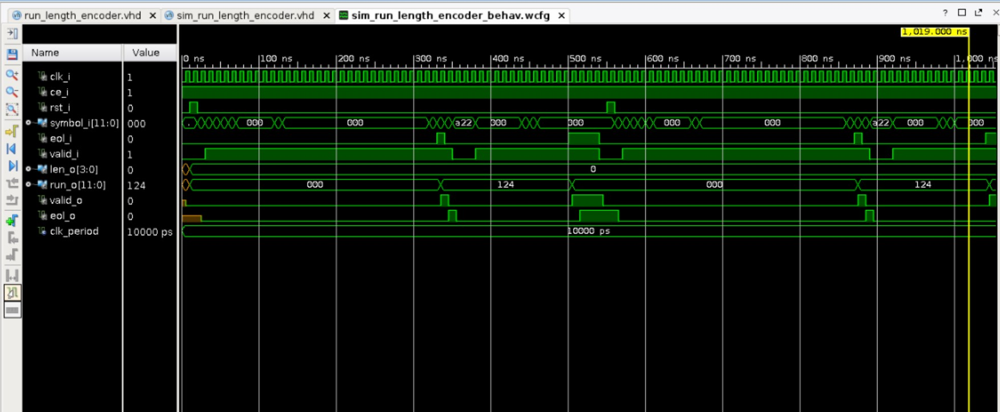
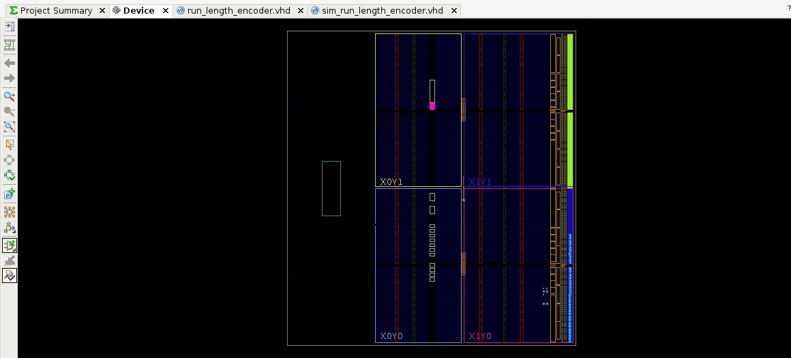

# Run-Length Encoder

Run-length encoder for encoding AC components in JPEG baseline architecture

__Author__

[Levindo Gabriel Taschetto Neto (IPVS)](http://levindoneto.com)

## Controller

State machine for controlling the increment of counter and sending data out.

## Datapath

Increasing internal counter, sending data out, verify if input is zero.

## The controller bases on Moore state machine with three states

## The input signals for Controller

* **eol_i :** informing that this is the end of AC component input.
* **valid_i:** informing that the current input symbol or eol_i is valid.
* **rst_i:** asynchronous reset signal.
* **is_zero_s:** set to 1 if current input symbol is zero, 0 otherwise.
* **is_overflow:** set to 1 if there is already 15 continuous zeros AC component received.

The output signals of Controller.
* **inc_s:** command Datapath to increase internal counter.
* **send_s:** command Datapath to send data out.

## The output signals for each state 

|          | S0 | S1 | S2 |
| -------- |:---|:---|:---|
| inc_s    | 0  |  1 |  0 |
| send_s   | 0  |  0 |  1 |

## Power Information

## Simulation

## Device

## Repository Structure

* [Scripts](scripts) (Used scripts to use the project on the Vivado tool).

* [VHDL Files](vhdl_files) (contains the vhdl files of the run-length encoder, as the hardware description and simulation).

## License

MIT License. Click [here](LICENSE.md) for more information about this license.

